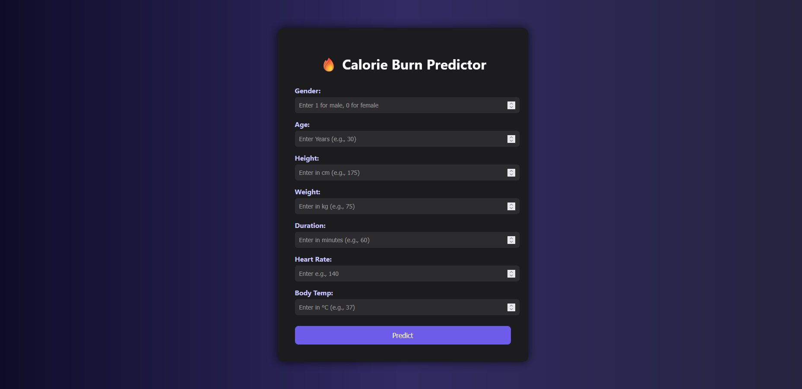
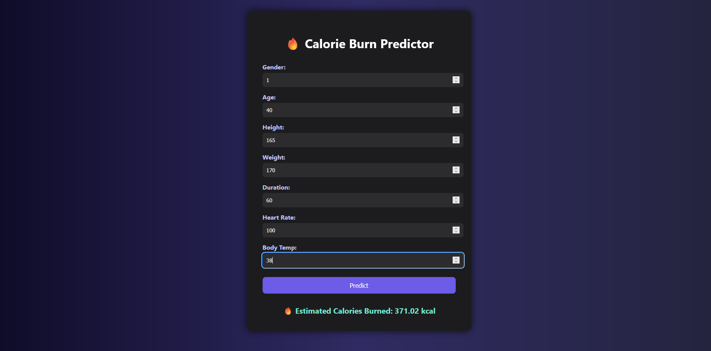
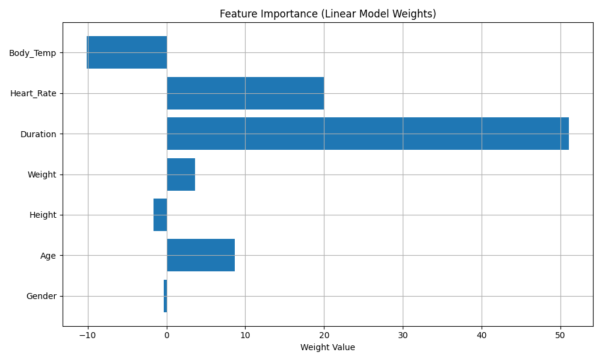
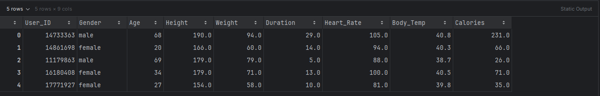

# 🔥 Calorie Burn Predictor – ML Web App

**Calorie Burn Predictor** is a machine learning web application that estimates how many calories a person burns during physical activity based on their biometric and workout data. Built entirely from scratch, this project demonstrates the full end-to-end development of an AI-powered solution — from data processing and model training to interactive deployment via a Flask web app with a modern UI.




---

## 🧠 What It Does & How It Works

This app uses a **linear regression model** trained on real-world biometric and activity data to predict calorie expenditure. Users input basic personal and workout details, and the model instantly returns an estimate of calories burned. The model was trained on a publicly available dataset and deployed using a custom HTML/CSS/Flask interface.

### 🔍 Inputs
- Gender (0 = Female, 1 = Male)
- Age (Years)
- Height (cm)
- Weight (kg)
- Duration (minutes)
- Heart Rate (bpm)
- Body Temperature (°C)

### 🧮 Outputs
- Estimated Calories Burned (kcal)

---

## 🛠️ Tools & Technologies

| Layer | Tools Used |
|-------|-------------|
| **ML Model** | TensorFlow / Keras |
| **Preprocessing** | Pandas, NumPy, StandardScaler |
| **Frontend** | HTML5, CSS3, custom dark theme |
| **Backend** | Flask (Python) |
| **Visualization** | Matplotlib |
| **Packaging** | Virtual environment + `requirements.txt` |

---

## 🧪 Model Enhancements

Several key improvements were made to ensure realistic and robust model behavior:

- ✅ **Standardization**: Input features were normalized using `StandardScaler` to avoid feature dominance and ensure smooth model convergence.
- ✅ **L2 Regularization**: Linear regression was regularized to prevent overfitting and limit extreme weight values.
- ✅ **Celsius Conversion**: Input temperatures entered in Fahrenheit are converted to Celsius at runtime to match the training data format.
- ✅ **Scaler Persistence**: The trained `StandardScaler` object is saved and reused in production for consistent preprocessing.

---

## 📊 Feature Importance (Model Weights)

The chart below visualizes the impact of each feature on the model’s output. Features like `Duration` and `Heart Rate` have the highest positive contribution to calorie prediction.



---

## 📁 Sample Dataset (Preview)

Here’s a snapshot of the original dataset used to train the model:




---

## 📦 Dataset Credit

Dataset provided by Ruchika Kumbhar on [Kaggle](https://www.kaggle.com/datasets/ruchikakumbhar/calories-burnt-prediction).  
All data belongs to the original author and was used here solely for educational purposes.

---

## 🚀 Run the App Locally

```bash
git clone https://github.com/your-username/calorie-burn-predictor.git
cd calorie-burn-predictor
python -m venv .venv
source .venv/bin/activate   # or .venv\Scripts\activate on Windows
pip install -r requirements.txt
python run.py     # Trains and saves model + feature graph
python app.py     # Launches Flask UI
```

Then go to: [http://localhost:5000](http://localhost:5000)

---

## 🤝 Let's Connect

If you like this project or want to collaborate on AI, fitness, or web tools — let’s chat!

📧 Email: ericramirez.aiml@gmail.com  
🔗 GitHub: [EirikRam](https://github.com/EirikRam)

---
